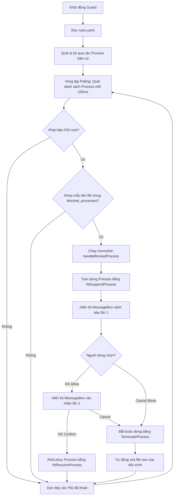

# Thinkmay Process Guard

Thinkmay Process Guard là một dịch vụ bảo vệ chạy ngầm trên Windows, được thiết kế để phát hiện, tạm dừng (suspend) và xử lý các tiến trình (đặc biệt là các phần mềm diệt virus hoặc bảo mật) có khả năng gây xung đột với hệ thống điều khiển máy ảo CloudPC của Thinkmay.

Phiên bản mới này đã loại bỏ hoàn toàn việc gọi PowerShell bên ngoài để xác minh chữ ký số, thay thế bằng cơ chế đối chiếu tên file sử dụng mẫu Wildcard cực kỳ nhẹ nhàng và tối ưu về mặt hiệu năng (0% CPU).

---

## 🚀 Luồng hoạt động chính (Workflow)

Chương trình hoạt động theo một vòng lặp liên tục kết hợp xử lý bất đồng bộ (Goroutine):



1. **Khởi động & Nạp cấu hình**: Đọc danh sách mẫu tiến trình bị chặn (`blocked_processes`) từ file `rules.yaml`.
2. **Khởi tạo danh sách bỏ qua (Seen list)**: Lưu trữ các PID hiện có khi Guard bắt đầu khởi chạy để tránh can thiệp vào các tiến trình có sẵn này.
3. **Vòng lặp giám sát nhẹ (Polling loop)**:
   - Quét danh sách tiến trình hệ thống định kỳ mỗi **100ms** thông qua API Windows `CreateToolhelp32Snapshot`. Cơ chế này rất nhẹ vì chỉ enumerate tên và PID trong RAM.
   - Đối với mỗi tiến trình:
     - Nếu là PID mới chưa từng thấy: Đánh dấu đã xem và so sánh tên tiến trình với các mẫu trong cấu hình bằng hàm `filepath.Match` (ví dụ: `avast*.exe`).
     - Nếu tên khớp cấu hình chặn, khởi chạy một **Goroutine** riêng biệt để xử lý (`handleBlockedProcess`).
4. **Dọn dẹp bộ nhớ (Garbage Collection)**:
   - Cuối mỗi vòng quét, chương trình tự động đối chiếu và xóa bỏ các PID đã thoát khỏi bản đồ theo dõi (`seen.m`).
   - Việc này giúp **ngăn ngừa rò rỉ bộ nhớ** (map không tăng vô hạn) đồng thời giải quyết triệt để lỗi **tái sử dụng PID (PID recycling)** trên Windows (nếu một tiến trình mới sử dụng lại PID cũ của tiến trình đã tắt, nó vẫn được quét bình thường).
5. **Xử lý tiến trình bị chặn (`handleBlockedProcess`)**:
   - Mở tiến trình và thực hiện đóng băng ngay lập tức bằng hàm native không công khai `NtSuspendProcess`.
   - Lấy đường dẫn đầy đủ của file thực thi bằng `QueryFullProcessImageNameW` để ghi log và hiển thị thông tin rõ ràng.
   - Hiển thị hộp thoại cảnh báo (`MessageBoxW`) trên cùng (`MB_TOPMOST`) hỏi người dùng.
   - **Xác nhận 2 bước khi chọn OK**: Nếu người dùng chọn **OK**, hệ thống hiển thị tiếp một hộp thoại phụ yêu cầu xác nhận lần cuối. Nếu xác nhận thành công, tiến trình được khôi phục qua `NtResumeProcess`. Nếu hủy bỏ ở bất kỳ bước nào, tiến trình sẽ đi vào luồng Chặn.
   - **Chặn và Xóa file khi chọn Cancel**: Nếu chọn **Cancel** (hoặc tắt hộp thoại), tiến trình lập tức bị tắt hẳn bằng `TerminateProcess`.
   - **Tự động xóa file an toàn**: Sau khi tắt tiến trình thành công, một Goroutine bất đồng bộ sẽ thử xóa file thực thi (`os.Remove`) với cơ chế thử lại (retry 10 lần, mỗi lần cách nhau 100ms) để đợi Windows giải phóng hoàn toàn handle của file. Nếu tắt tiến trình thất bại, chương trình tự động phục hồi tiến trình qua `NtResumeProcess` để tránh treo hệ thống vĩnh viễn.

---

## 🛠️ Các API Windows sử dụng

| Tên API | DLL nguồn | Mục đích sử dụng |
| :--- | :--- | :--- |
| `CreateToolhelp32Snapshot` / `Process32First` / `Process32Next` | `kernel32.dll` | Quét danh sách các tiến trình đang hoạt động siêu tốc trong RAM. |
| `QueryFullProcessImageNameW` | `kernel32.dll` | Lấy đường dẫn tuyệt đối của file thực thi phục vụ hiển thị/ghi log. |
| `NtSuspendProcess` | `ntdll.dll` | API Native để đóng băng toàn bộ luồng thực thi của tiến trình bị chặn ngay lập tức. |
| `NtResumeProcess` | `ntdll.dll` | Giải phóng trạng thái đóng băng để tiến trình tiếp tục chạy bình thường. |
| `MessageBoxW` | `user32.dll` | Hiển thị thông báo tiếng Việt đè lên tất cả các cửa sổ khác (`MB_TOPMOST` \| `MB_SETFOREGROUND`). |
| `TerminateProcess` | `kernel32.dll` | Buộc đóng tiến trình bị chặn khi người dùng hủy bỏ. |

---

## ⚙️ Định dạng cấu hình `rules.yaml`

File cấu hình sử dụng trường `blocked_processes` chứa mảng các mẫu tên file thực thi hỗ trợ ký tự đại diện Wildcard (`*`, `?`).

**Ví dụ cấu hình:**
```yaml
blocked_processes:
  - rav*.exe
  - reasonlabs*.exe
  - 360ts*.exe
  - avast*.exe
  - avg*.exe
  - mcafee*.exe
  - norton*.exe
  - malwarebytes*.exe
```
*Ưu điểm: So khớp không phân biệt chữ hoa/thường, tự động hỗ trợ các phiên bản hoặc đuôi tên thay đổi (ví dụ: `avast_free.exe` sẽ khớp mẫu `avast*.exe`).*

---

## 📈 Đánh giá hiệu năng và Tính thực tế

1. **Hiệu năng vượt trội (0% CPU)**: 
   - Không còn hiện tượng gọi tiến trình con PowerShell để check chữ ký số nên hoàn toàn loại bỏ vấn đề nghẽn CPU và nghẽn tài nguyên do khởi tạo PowerShell.
   - Việc so khớp Wildcard bằng `filepath.Match` diễn ra hoàn toàn trong RAM với độ trễ nano-giây.
2. **Khắc phục lỗi treo tiến trình ngầm**:
   - Bằng cách loại bỏ kết nối mạng kiểm tra CRL và PowerShell, tiến trình bị chặn sẽ được đóng băng lập tức mà không gặp bất kỳ độ trễ hay tình trạng treo luồng nào.
3. **Quản lý bộ nhớ thông minh**:
   - Bộ dọn dẹp PID (Garbage Collection) tích hợp cuối vòng lặp đảm bảo ứng dụng có thể chạy liên tục nhiều tháng liền mà dung lượng RAM tiêu thụ không thay đổi.
